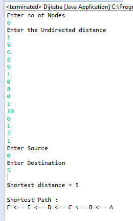

# Dijkstra

Using Dijkstra’s algorithm to implement a program that computes the shortest distance between two nodes of an undirected weighted graph. Then, using its output to automatically identify a shortest path in the graph.

## Input

* The graph, given by providing in sequence: the number of nodes, then a sequence of arcs with associated length.
* The source.
* The destination.

## Output

* The shortest distance.
* A shortest path.

Console screenshot  

Graphical output  

